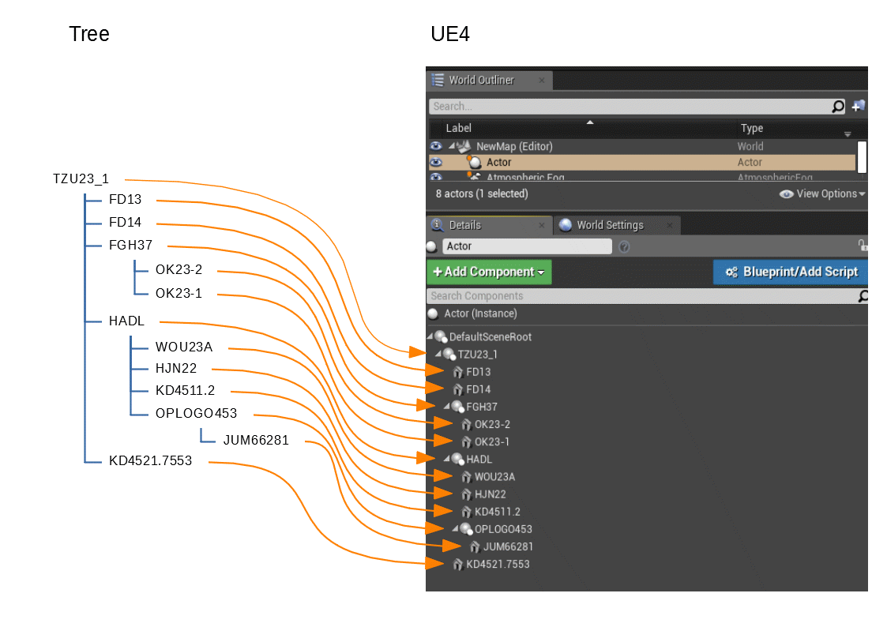

# UE4: Rearranged ChildComponents
*UE4 C++ - Restores the arrangement of child components after loading a project*

## Background: Tree to UE4

I worked on a project in which nested, abstract structures (trees) had to be visualized. The trees consisted of two elements: branches and leaves. Each branch can contain any number of child elements (child branches and child leaves). A leaf has no other sub-elements that would be interesting for the visualization. The location, rotation and scaling of elements in 3D space depends on their position in the abstract tree.

The tree-like structures that I was supposed to visualize were very large. Therefore, the generation of their visualization took quite a long time. The calculation of the shaders also took a long time. Therefore, the requirement came up that you should be able to save the generated visualization (including shader calculation). For this, it was advisable not to perform these calculations procedurally live in one level, but to have them completely calculated in the editor at design time. 

Since it should be better because of the draw calls to have as few actors as possible, I decided to create the structural elements of components and to attach them to an actor. So I programmed a branch component (based on `USceneComponent`) and a leaf component (based on `UStaticMeshComponent`). An actor could read in a file in which the tree structure was defined and generate the structure as a nested component structure of branch and leaf components. The names of the components were generated from the name of the respective element as well as its position in the tree. The location, rotation and scaling resulted from the position in the tree and was automatically updated as soon as a new component was added.



## Myterious

I programmed and tested the visualization and was very happy with the result until ... until I showed the result to a colleague. Until then, I had been working with comparatively small trees, since the generation of their visualization took so long. Of course, I wanted to impress the colleague and had a really bombastic tree generated overnight. The next morning the shaders were calculated. The result looked really impressive! I saved the level for safety's sake and reloaded it in the afternoon to show it to my colleague.
During the demonstration, the colleague noticed that the tree structure was visualized incorrectly. Although there were all the lower elements on a branch, but arranged wrong! As a result, there were overlaps that should not exist and that I had not noticed so far. Mysterious!

In the evening, I did a lot of testing but was not able to reproduce the wrong result, that we had seen. I checked the bombastic tree, if there was something special in it. I had split the bombastic tree up in smaller chunks and tested each of them separately. The visualization of the structure was correct, in every case. Mysterious, again! 

## The wrong assumption

After a few days of unsuccessful testing, logging, creating crazy tree structures, I finally found what the error was. My algorithm seemed to work, but it was based on a wrong assumption. Wait:  "wrong assumption" does not actually apply. While developing the algorithm, I assumed a certain expectable behavior of the underlaying system, which did not happen in this case. 

### Attaching Components

You can attach different kinds of components to each actor you dropped in a level in the editor of the Unreal Engine 4. Some of these components can be nested (those based on so called *scene components*), others not (those based on *actor components*). The components will be attached in the order of attachment. So, the least attached component is listed as last in the list of child components. You are able to change the arrangement of child components by attaching one of them to another component and then reattach them to the previous parent component. This component will now be the new last component. It is not possible to automatically order the child components (for instance based on an attribute).

My algorithm which calculates the location, rotation and scaling of the created branch and leaf components according to their position in the tree, is based on the arrangement of child components. This works fine until ... until I save and reloaded the level. If you save and reloaded a level, UE4 rearranges the child components. Of course, in some cases this new arrangement corresponds to the previous arrangement. 

But have a look at the animation:


## Recreate this behavior

If you want to recreate this behavior: Simply create a new, empty C++ project in the Unreal Editor, drop an empty actor to the level, add a scene component as root component to the actor, add different components to this root component (works for components based on `USceneComponent` like `UStaticMeshComponent`, the lights and collision detection components) and finally find some names for these components. In case of the animation, I used the following components:

|  Nr  | Name        | Component                |
| :--: | ----------- | ------------------------ |
|  1   | ZPlane      | `UStaticMeshComponent`   |
|  2   | MPointLight | `UPointLightComponent`   |
|  3   | ASphere     | `UStaticMeshComponent`   |
|  4   | OBox        | `UBoxCollisionComponent` |

Then simply save the level, reload it and tadaaaa! the components are reordered:

|  Nr  | Name        | Component                |
| :--: | ----------- | ------------------------ |
|  1   | OBox        | `UBoxCollisionComponent` |
|  2   | MPointLight | `UPointLightComponent`   |
|  3   | ASphere     | `UStaticMeshComponent`   |
|  4   | ZPlane      | `UStaticMeshComponent`   |

Without having done further investigation in the UE4 source code, especially the `FArchive` struct and the `serialize` methods, it seems that during the process of saving and reloading the arrangement of child components will be mixed up. The reordering algorithm seems to be the following:

1. Group the components by component class name (i.e. `UStaticMeshComponent` , `UBoxCollisionComponent`)
2. In each component class name group order the components by component name (i.e. `ASphere`, `ZPlane`, both `UStaticMeshComponents`)

Nice, isn't it? For me, this was no expectable behavior. And even at the moment I write this, I can not really believe that's what happens. Although I have tried different variants, have tested different versions of the UE4 (UE4.18 - UE4.23) and also colleagues could find the behavior, I still think I make a mistake somewhere. I still think that can not be true! Ultimately, maybe I will only be sure if I had analyzed the program code. Meanwhile, however, I have also found out that other developers have been annoyed about this problem too, albeit in the Blueprint Editor. Maybe I'll look at the program code later, I just needed one of those nice work-arounds.

## Work arounds

I tried different work-arounds:

1. Using actors instead of components: can't be arranged at all, will always be ordered by alphabet (please, tell me why!?!)
2. Using component sockets: you can't attach a component to a socket in the editor (but you can using C++ only), only actors can be attached to sockets (of the highest-level component) of other actors
3. Using a separate array just for arranging: very hard to use because the structure shown in the component panel may not be the the one the algorithm works with

## Final solution

### Arrays

Doing some investigation I found the element arrangement of arrays is not changed while saving and loading. This seems to be true even if there were object pointers stored in the array. (This is more surprising since internally the administration of the child components also takes place in an array. I suspect, therefore, that the problem does not come from saving or loading the component, but from creating the object and attaching them to the parent component.) 

So, a simple solution would be to create an array for the child components and only keep an eye on this array (ignoring the component arrangement in the editor). Because I want to be able to for instance rearrange the tree elements after loading and delete branches, I need a solution where I can relay on the component arrangement. And I can relay on it as long as I do not save and reload the level. So if I would be able store the current child component arrangement of each branch while saving and recreate the arrangement while loaded, everything would be fine. At least for me and till now.

```c++
UPROPERTY()
	TArray<USceneComponent*> ArrangedChildComponents;
```

So I try to find out, how to get a signal when saving starts and when loading is finished. I created a project with an actor and and scene component that implement all virtual functions of their base classes and wrote some logging output in these functions to get a hint when which function will be called. When I save the level for instance, the function `serialize` is called often. I did some further investigations, kept an eye on the attributes of the `FArchive` struct and had a look in the other classes of the UE4. Finally I used the `IsSaving()` attribute as signal and transferred the current arrangement of components to a helper array. This helper array while be saved with the component in the regular way.

```c++
if (Ar.IsSaving()) {
	GetChildrenComponents(false, ArrangedChildComponents);
}
```
### The end of the loading phase

Getting a hint, when loading phase is finished was a little bit more tricky. More precisely, I need a signal not after loading, I need a signal after the all child components where created and attached. I need a `PostAllChildComponentsAttached` event. Unfortunately, there is no such event. The last events I can catch before the level is loaded are `OnAttach` events for each of the attached child components.

If I want to used the `OnAttach` events I have to find out if the component that actually should be attach is the right one in order, prevent the component from being attached if not and attach it later at the right position in the arrangement order. And if you rearrange the child components in the editor, the `OnAttach` as well as the `OnDetach` should work in another way. 

Luckily I found a `PostRegisterAllComponents()` event in the actor, which is called after all components are registered and attached. I could use this event to instruct all child components of type branch component to rearrange their child components according to the previously saved arrangement. For that, I created a `PostRegisterSubComponents()` in the branch component and called this method in a loop.

```c++
TArray<UActorComponent*> MySceneComponents = GetComponentsByClass(UMySceneComponent::StaticClass());
	for (UActorComponent* comp : MySceneComponents) {
		UMySceneComponent* myscenecomponent = Cast<UMySceneComponent>(comp);
		if (myscenecomponent) {
			myscenecomponent->PostRegisterSubComponents();
		}
	}
```

So even I have to create an tree actor AND a branch component, even I have to reattach all the items after loading the tree and even there may be better solutions out there, actually this solution for me is good enough.

Hopefully, this short investigation will help others finding a work-around for this strange behavior.